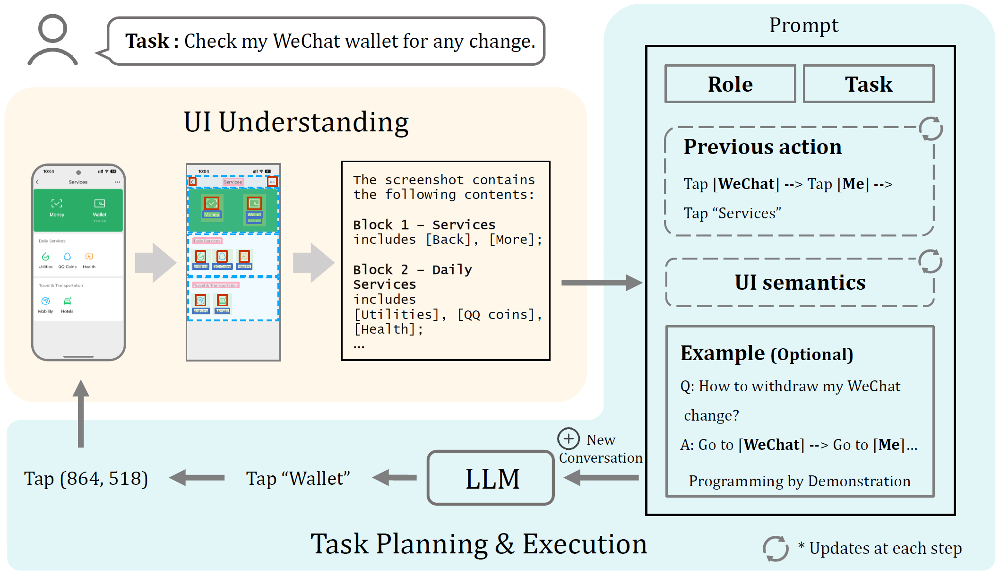

# 📱 VisionTasker 🤖
[[Paper(arxiv)]](https://arxiv.org/abs/2312.11190) 
[中文readme](https://github.com/AkimotoAyako/VisionTasker/blob/main/readme_zh.md)

## 📰 Abstract
**VisionTasker** introduces a novel two-stage framework combining vision-based UI understanding and LLM task planning for mobile task automation in a step-by-step manner.


#### Feature
1. **Vision-Based UI Understanding**：Translating UI screenshots into natural language explanations using a vision-based approach eliminates the dependency on view hierarchies.

2. **Step-by-Step Task Planning**：Presents one interface at a time to the LLM (in the form of natural language), which determines the next action based on relevant elements within the interface with historical operational information.

🥳The method enhances accuracy and practicality, leading to superior performance in mobile task automation.（Successfully automates 147 real-world tasks on Android smartphones, surpassing human performance in complex tasks.）

## 📢 Release
Here's the first version🤗

## 👩‍💻 Prepare
Hardware: 1. Windows system computer; 2. Android mobile phone with data cable

🙌 `Python 3.8` recommended

Make sure you have installed the [Android SDK](https://developer.android.com/tools/releases/platform-tools?hl=en) correctly to use the ADB function (remember to turn on the Developer Mode of your phone and allow debugging by the computer) 🍾

Run
```
git clone https://github.com/AkimotoAyako/VisionTasker.git
conda create -n visiontasker python=3.8
pip install -r requirements.txt
```

Note to check that the gpu version of pytorch is used
Model path: Put pre-trained models (target detection model and CLIP) under `pt_model/`

## 🚀 Usage

#### `/`
- `main_en_auto.py`：Automates the entire process；
- `main_zh_bystep.py`: Step by step automation (Interactive prompt in Chinese).
    1. Enter the task content: If you use the task table in "data" for input：enter "m" first, and then enter the task number "xx" corresponding to the task table (VisionTasker\data\task.xlsx), or directly enter "m xxx".If you want to enter the task content directly: enter "m" first, then enter the task content.
    2. Screenshot recognition: Input "i" (start with i to prevent redundant misinput); After the llm command output is completed by the operator, take the next screenshot until the task is completed.
    3. To restart a task or start another task, just go back to step 1
- `test_gpt4v_realworldword.py`: Benchmarks using GPT-4V. Mobile interface elements are pre-labeled with IDs. GPT-4V receives images and tasks and returns operation IDs.
- `test_gpt4v_realworldword_withoutid.py`: Benchmarks using GPT-4V. GPT-4V receives images and tasks and returns the operation button name for human execution.

#### `├─ data/`
- `help_table/`: Examples for demonstration and help documentation.
- `outputs/`: Output file path for UI recognition results.
- `screenshot/`: Storage path for each step's screenshots.

#### `├─ core/`
Contains the main operation process scripts:
- `Config.py`: Various configuration items (detection methods, language, models, output paths, etc.).
- `LLM_api.py`: **Modify the key for the large language model here**.

#### `├─ core_gpt4v/`
Benchmarks using GPT-4V method's main operation scripts:
- `LLM_api.py`: **Modify the key for the large language model here**.

#### `├─ element/detect_text/`
- `text_detection.py`: **Modify the key for the ocr model here (Line 135~136)**.

## 🍴 Model
Will be uploaded in the form of cloud disk.

## 🌷Acknowledge
Part of the implementation is based on the open-source project [MulongXie/GUI-Perceptual-Grouping](https://github.com/MulongXie/GUI-Perceptual-Grouping).

Without their contributions, our UI detection framework would not be as refined as it is today. We extend our sincere gratitude to them.
