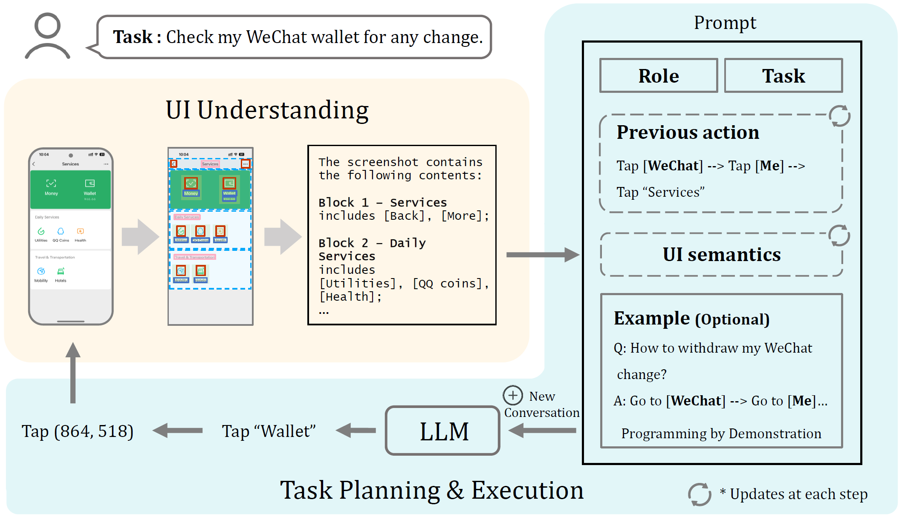
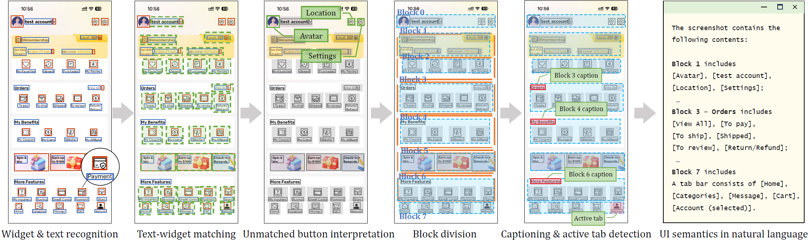

# 📱 VisionTasker 🤖
[](https://arxiv.org/abs/2312.11190)
[](https://dl.acm.org/doi/10.1145/3654777.3676386)

## 📰 简介
**VisionTasker** 引入了一种结合基于视觉的UI理解和LLM任务规划的两阶段框架，用于逐步实现移动任务自动化。


#### 特点
1. **基于视觉的UI理解**：通过基于视觉的方法将UI截图转换为自然语言解释，消除了对视图层次结构的依赖。传统的视图层次结构存在可访问性问题，并且可能缺失对象的描述或存在一些结构错位。

2. **逐步任务规划**：一次展示一个界面（自然语言的形式）给LLM，LLM根据界面内的相关元素与历史的操作信息确定下一步的行动。

🥳方法提高了准确性和实用性，在移动任务自动化中表现出色（成功自动化了Android智能手机上的147个现实任务，在复杂任务中表现超过人类）

## 📢 最新消息
这是我们上传的第一版🤗

[2024-10-16] 模型上传了 （叉腰.jpg）🧐 

## 👩‍💻 配置环境
硬件准备：1. Windows系统电脑；2.安卓手机与配套数据线

🙌推荐Python 3.8

确保您已经正确安装了`Android SDK`，能够使用ADB功能（记得开启手机的设置开发者模式，允许由电脑调试）🍾

>简要的`Android SDK`安装教程：
>1. 确保有`JAVA`环境；
>2. 从[这里(放心是官网)](https://developer.android.com/tools/releases/platform-tools?hl=zh-cn)下载并安装`Android SDK`；
>3. 对于Windows系统，配置环境变量（新建变量`ANDROID_HOME`，变量名为安装路径；并在path变量后新建：`%ANDROID_HOME%\platform-tools`）；
>4. 在命令行输入`adb`进行验证，连接手机后可以输入`adb devices`查看连接设备。

运行：
```
git clone https://github.com/AkimotoAyako/VisionTasker.git
conda create -n visiontasker python=3.8
pip install -r requirements.txt
```
注意检查是否使用了gpu版本的pytorch
模型路径：将预训练模型（目标检测模型、CLIP分类模型）放在`pt_model/`下

输入法：
涉及在手机上输入文字的部分，请参考[ADBKeyBoard](https://github.com/senzhk/ADBKeyBoard)并在手机和电脑上进行对应安装

## 🚀 文件与使用说明
#### `/`
- `main_en_auto.py`：整个流程的自动化实现；

- `main_zh_bystep.py`：整个流程的单步实现（中文提示）；

  1. 输入任务内容：若使用data中的任务表进行输入：先输入m，再输入任务表中(VisionTasker\data\task.xlsx)对应的任务序号xx, 也支持直接输入"m xxx"；若是要直接输入任务内容：先输入m，再输入任务内容。

  2. 截图识别：输入"i" (以i开头即可, 防止多余的误输入); llm输出的指令被执行器完成后，则继续进行下一次截图，直至任务完成。

  3. 若要重新开始当前任务或者开始另一个任务，返回步骤1即可
    
- `test_gpt4v_realworldword.py`：benchmarks，使用GPT-4V的方法，手机界面元素被事先标注id，GPT-4V接收图像和任务，返回操作id；

- `test_gpt4v_realworldword_withoutid.py`：benchmarks，使用GPT-4V的方法，GPT-4V接收图像和任务，返回操作按钮名称，由人代替操作


#### `├─ data/`
- `help_table/`：示教与帮助文档数据示例；

- `outputs/`：UI界面识别结果输出文件路径；

- `screenshot/`：每一步截图的存储路径

#### `├─ core/`
包含主要的操作流程脚本：

- `Config.py`：各种配置项（检测方式、语言、模型和输出路径等）；

- `LLM_api.py`：**在此处修改大语言模型的key**


#### `├─ core_gpt4v/`

benchmarks，使用GPT-4V的方法的主要的操作脚本：

- `LLM_api.py`：**在此处修改大语言模型的key**

#### `├─ element/detect_text/`

- `text_detection.py`: **在此处修改ocr模型的key(第135~136行)**
 
## 🍴 模型
[☁️ 谷歌云](https://drive.google.com/drive/folders/1ij5Y5JhUb8cPTAr8fZ0jfyenoNUqr5nP?usp=sharing)

[☁️ 夸克云盘](https://pan.quark.cn/s/f2f707e26a08)
 
## 🌷致谢
部分实现基于开源项目 [MulongXie/GUI-Perceptual-Grouping](https://github.com/MulongXie/GUI-Perceptual-Grouping)。

没有他们的贡献，我们的UI检测框架不会像今天这样完善。在此，致以诚挚的谢意。
